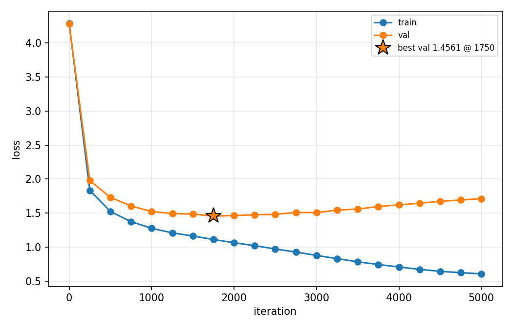
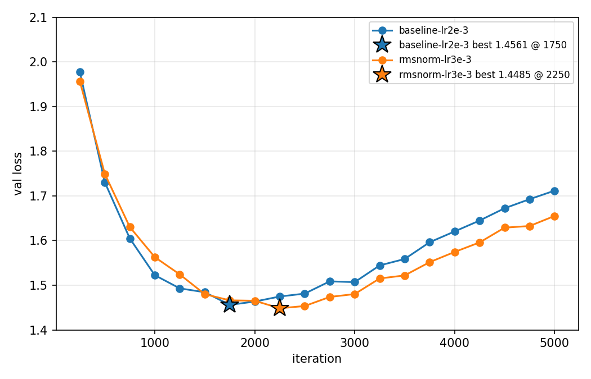
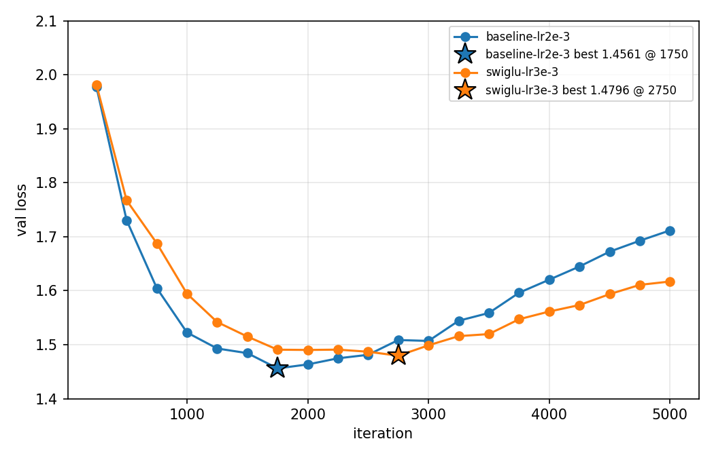
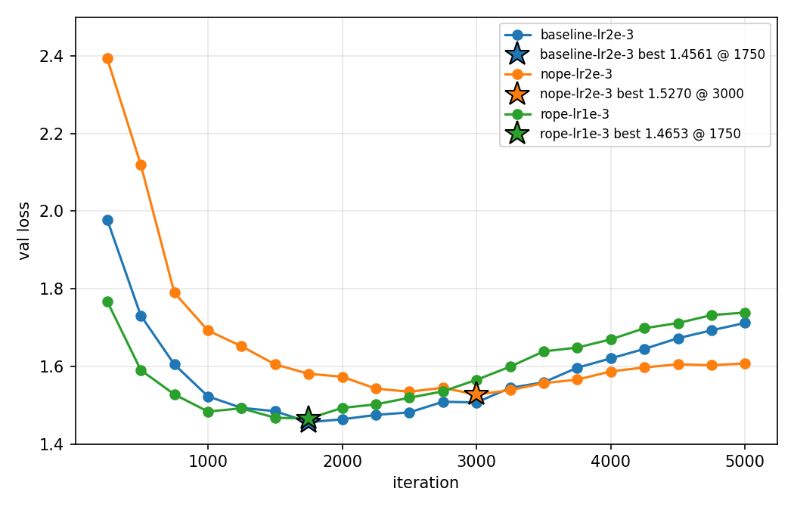
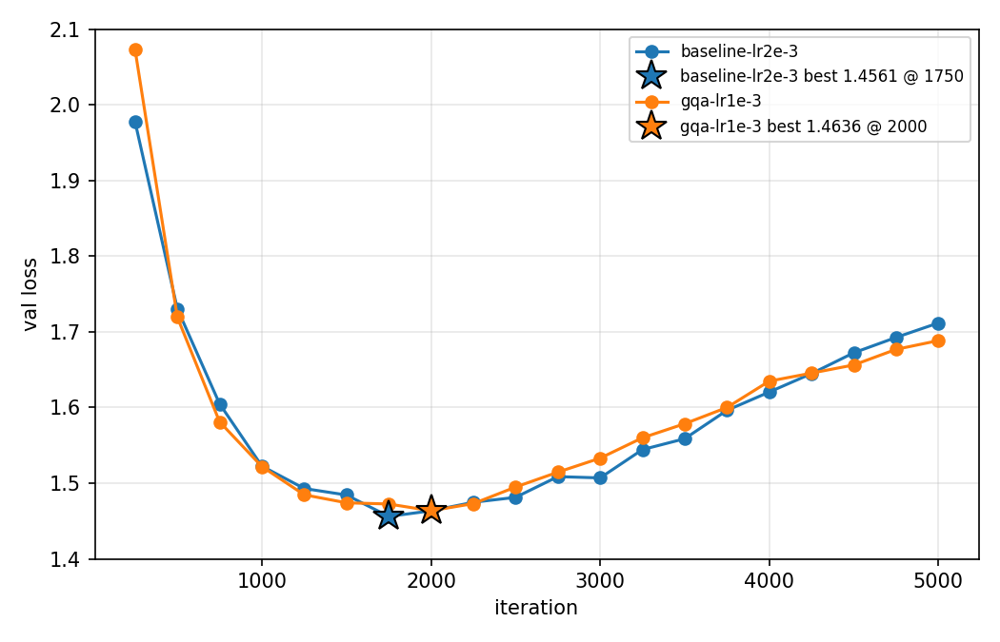

# Mini-LLM Exercise: nanoGPT architecture ablations

## Setup

Every model is a character-level language model trained on Tiny Shakespeare, starting from `config/train_shakespeare_char.py`. I ran each experiment in two settings:

| | **Main: default config (GPU)** | **Secondary: reduced config (CPU)** |
|---|---|---|
| Model | 6 layers, 6 heads, `n_embd` 384 (10.7M params) | 4 layers, 4 heads, `n_embd` 128 (0.8M params) |
| Context / batch | 256 / 64 | 64 / 12 |
| Iterations | 5000 | 2000 |
| Dropout | 0.2 | 0.0 |
| Eval | every 250 iters, 200 batches | every 250 iters, 20 batches |
| Hardware | NVIDIA L4, bf16, `torch.compile`, PyTorch 2.9.1 | MacBook CPU |

The **main setting** is the unmodified default config, as the assignment specifies. The **secondary setting** uses the README's "I only have a macbook" settings. I ran it first, and kept it because the two settings end up in different training regimes, which explains several of the results.

Both settings share the same protocol:
- **One change at a time.** Each sub-problem changes exactly one component relative to the baseline. Everything else, including the seed (1337), is held fixed.
- **Tuned learning rate.** For each variant, I swept the learning rate and report the run with the lowest validation loss, with `min_lr` set to lr/10 as in the original config. Every reported optimum has a worse learning rate tried on both sides of it.
- **Minimum val loss, not final.** In the default config, every variant overfits: the best run of each reaches its minimum between iterations 1750 and 3000, and val loss then rises (see §1). So "best val" means the minimum over all evals, which amounts to early stopping.

All variants are behind flags in `model.py` (`norm_type`, `mlp_type`, `pos_type`, `n_kv_head`). With the default flags, the model is the original nanoGPT. I checked that the baseline gives a bit-identical loss before and after each code change.

## Summary

**Main setting (default config, GPU):**

| Variant | Change vs. baseline | Params | Best LR | Best val (iter) | vs. baseline |
|---|---|---|---|---|---|
| **Baseline** | Pre-LN LayerNorm, GELU MLP, learned absolute positions, MHA | 10,745,088 | 2e-3 | **1.4561** (1750) | — |
| RMSNorm | LayerNorm → RMSNorm | 10,745,088 | 3e-3 | 1.4485 (2250) | −0.008 (tie) |
| SwiGLU | GELU MLP → SwiGLU, hidden 1024 | 10,745,088 (same) | 3e-3 | 1.4796 (2750) | **+0.024 (worse)** |
| NoPE | Positional embedding removed | 10,646,784 (−0.9%) | 2e-3 | 1.5270 (3000) | **+0.071 (worse)** |
| RoPE | Learned positions → rotary on q, k | 10,646,784 (−0.9%) | 1e-3 | 1.4653 (1750) | +0.009 (tie) |
| GQA | 6 query heads share 3 KV heads (group size 2) | 9,860,352 (−8.2%) | 1e-3 | 1.4636 (2000) | +0.008 (tie) |

**Both settings side by side** (each variant's tuned best minus the tuned baseline):

| Variant | Reduced config (CPU) | Default config (GPU) |
|---|---|---|
| RMSNorm | +0.009 (tie) | −0.008 (tie) |
| SwiGLU | **−0.051 (better)** | **+0.024 (worse)** |
| NoPE | **+0.264 (much worse)** | **+0.071 (worse)** |
| RoPE | **−0.030 (better)** | +0.009 (tie) |
| GQA | +0.014 (tie / slightly worse) | +0.008 (tie / slightly worse) |

All runs use a single seed. I treat differences under about 0.01–0.015 as ties.

**Key observation.** The reduced CPU model is **undertrained**: val loss is still falling at iteration 2000, and train and val loss are close. The default GPU model is **overfitting**: val loss bottoms out (at about 1.45–1.48 for every variant except NoPE) and then rises, while train loss keeps falling. Changes that help the model fit faster (SwiGLU, RoPE) win in the undertrained regime, but not when the score is an early-stopped minimum limited by the small dataset (about 1M characters). NoPE is worse in both, but its gap shrinks a lot in the default config.

---

## 1. Baseline

**Default config (main).** With the default learning rate of 1e-3, the baseline reaches its best val loss of **1.4718** at iteration 1750. That matches the ~1.47 the nanoGPT README reports for this config, so the setup reproduces the reference. Tuning the learning rate gives **1.4561** at lr 2e-3.

| LR | 5e-4 | 1e-3 | 2e-3 | 3e-3 |
|---|---|---|---|---|
| Best val (iter) | 1.4710 (2250) | 1.4718 (1750) | **1.4561** (1750) | 1.4595 (1750) |



The plot shows the overfitting. Val loss reaches its minimum at iteration 1750, then rises to 1.71 by iteration 5000. Train loss keeps falling, to 0.61. Dropout 0.2 slows this down but doesn't prevent it on a dataset this small.

**Reduced config.** The tuned baseline reaches **1.7587** at lr 3e-3 (1.8857 at the default 1e-3). Val loss is still decreasing at the final iteration, and the train/val gap is only about 0.16, so this model is undertrained rather than overfitting.


## 2. LayerNorm

**Is the model pre-LN or post-LN?** It is **pre-LayerNorm**. In `Block.forward`, normalization is applied to the input of each sub-layer, inside the residual branch:

```python
x = x + self.attn(self.ln_1(x))
x = x + self.mlp(self.ln_2(x))
```

The residual stream itself is never normalized, except by a final `ln_f` before the LM head. Post-LN would instead normalize after the addition: `x = LN(x + attn(x))`.

**Change.** RMSNorm rescales by the root mean square, `x / sqrt(mean(x²) + ε) · g`, with no mean subtraction and no bias. Both settings use `bias=False`, so the baseline LayerNorm also has no bias. The only real difference is LayerNorm's mean-centering, and the parameter count doesn't change.

**Results (default config):**

| LR | 5e-4 | 1e-3 | 2e-3 | 3e-3 | 5e-3 |
|---|---|---|---|---|---|
| LayerNorm | 1.4710 | 1.4718 | **1.4561** | 1.4595 | — |
| RMSNorm | — | 1.4682 | 1.4624 | **1.4485** | 1.4558 |



**Comparison.** **No meaningful difference.** At matched learning rates, RMSNorm is −0.004, +0.006 and −0.011 relative to LayerNorm. The sign flips, so the gap is noise. The best-vs-best difference (−0.008) is within that same noise. The reduced config agrees: RMSNorm is +0.009, again with a sign that flips across learning rates (`plots/cpu/rmsnorm.png`).

This fits the motivation for RMSNorm: the re-scaling does the useful work, not the re-centering. RMSNorm gets the same quality with slightly less computation. (I didn't measure the speed difference.)

## 3. MLP

**What activation does the MLP use?** **GELU** (`nn.GELU()`, the exact erf form). The MLP is `Linear(d → 4d) → GELU → Linear(4d → d)`.

**Change.** SwiGLU replaces it with a gated MLP:

```
MLP(x) = W_down( SiLU(W_gate x) ⊙ (W_up x) )
```

SwiGLU has three weight matrices instead of two. To keep the parameter count the same, I scaled the hidden width by 2/3: h = (2/3)·4d, rounded up to a multiple of 8.
- In the default config (d = 384), h = 1024. That gives exactly the same parameter count as GELU (3·384·1024 = 2·384·1536).
- In the reduced config (d = 128), h = 344, which is +0.5% parameters.

**Results (default config):**

| LR | 1e-3 | 2e-3 | 3e-3 | 5e-3 |
|---|---|---|---|---|
| Baseline (GELU) | 1.4718 (1750) | **1.4561** (1750) | 1.4595 (1750) | — |
| SwiGLU | 1.4892 (1250) | 1.4886 (1750) | **1.4796** (2750) | 1.7280 (5000) |



**Comparison.** In the default config, **SwiGLU is worse**: +0.024 at the tuned best, and worse at every matched learning rate, by 0.017–0.033. **This is the opposite of the reduced config,** where SwiGLU was the best single change. There it was −0.051 at the tuned best, and better by about 0.05 at every learning rate (`plots/cpu/swiglu.png`).

A plausible reading is that the two settings reward different things:
- In the **undertrained** reduced config, what matters is how quickly the model fits, and the gated MLP fits faster per parameter. It reaches a lower train *and* val loss.
- In the **overfitting** default config, the val loss minimum is limited by the dataset size, not by how quickly the model fits. At lr 1e-3, SwiGLU reaches its minimum earlier than the baseline (iteration 1250 vs. 1750) and ends with lower train loss (0.508 vs. 0.622). It fits the training set faster and starts overfitting sooner.
- At higher learning rates SwiGLU's minimum comes later, but it's still not as low. At 5e-3 it trains poorly: train loss is still 1.49 at the end, so the rate is too high for stable training.

I haven't verified this explanation directly. Doing so would need, for example, more dropout or a larger dataset. The measured result is that SwiGLU's advantage doesn't carry over to the overfitting regime.

## 4. Positional encoding

**What positional embedding does the model use?** **Learned absolute positional embeddings.** `wpe = nn.Embedding(block_size, n_embd)` holds one trainable vector per position (256 in the default config), which is added to the token embedding before the first block.

**Variants.**
1. **NoPE.** `wpe` is removed, and token embeddings enter the blocks directly. The causal attention mask is then the only source of position information.
2. **RoPE.** `wpe` is removed. Inside each attention layer, after splitting into heads, every (even, odd) channel pair of the queries and keys is rotated by the angle `pos · θ_i`, with `θ_i = 10000^(−2i/d_head)`. Values are not rotated. I checked that q·k then depends only on the offset between positions: the score for positions (10, 7) equals the score for (40, 37).

Both variants lose the `wpe` table: 256 × 384 = 98,304 parameters (−0.9%) in the default config.

**Results (default config):**

| LR | 5e-4 | 1e-3 | 2e-3 | 3e-3 |
|---|---|---|---|---|
| Learned | 1.4710 | 1.4718 | **1.4561** | 1.4595 |
| NoPE | — | 1.5332 | **1.5270** | 1.6674 |
| RoPE | 1.4717 | **1.4653** | 1.4710 | 1.4702 |



**Comparison.**
- **NoPE is clearly worse:** +0.071 at the tuned best, and worse at every matched learning rate (+0.06, +0.07, +0.21). Without positional information, a first-layer attention score depends only on token content. So the layer can't tell "the previous character" apart from the same character further back. The causal mask leaks position indirectly (position *t* attends over exactly *t*+1 tokens), so the model can build a positional signal in early layers and use it later. But it has to spend depth and training time deriving that signal. That shows in the curves: NoPE is far behind early on (2.39 against 1.98 at iteration 250).
- **NoPE's gap is much smaller than in the reduced config** (+0.071 vs. +0.264, see `plots/cpu/posenc.png`). The default model has more layers, a longer context and more training steps, which gives it more room to derive position. I changed all of these at once, so I can't say which one matters. NoPE also overfits the least of the three: its minimum comes latest (iteration 3000), and its final val loss is the lowest (1.61 against 1.71 for the baseline).
- **RoPE learns fastest but ends up tied:** +0.009 at the tuned best, with matched learning rates going both ways. Its curve is clearly lowest early (1.77 against 1.98 at iteration 250) and stays lowest until about iteration 1500. Then it overfits fastest, and its early-stopped minimum is about the same as the baseline's. RoPE builds relative position directly into the attention score, which is the information next-character prediction needs, so it learns faster. That's why it won in the undertrained reduced config (−0.030, ahead at every eval). When the score is an early-stopped minimum, learning faster doesn't help.

## 5. Grouped-query attention

**Change.** The baseline uses multi-head attention, where each of the 6 heads has its own query, key and value projections. With GQA at group size 2, there are still 6 query heads but only **3 key/value heads**: query heads (0, 1) share KV head 0, (2, 3) share KV head 1, and (4, 5) share KV head 2. In the reduced config, it's 4 query heads and 2 KV heads.

In code, the K and V projections output `n_kv_head · head_dim` features instead of `n_embd`, and `repeat_interleave` copies each KV head to its group before attention. I checked correctness: the GQA model gives exactly the same outputs as an MHA model whose K and V weights are duplicated within each group. This removes half of the K and V projection weights, 884,736 parameters (−8.2%). At inference time it also halves the KV cache.

**Results (default config):**

| LR | 5e-4 | 1e-3 | 2e-3 | 3e-3 |
|---|---|---|---|---|
| MHA (baseline) | 1.4710 | 1.4718 | **1.4561** | 1.4595 |
| GQA | 1.4810 | **1.4636** | 1.4650 | 1.4648 |



**Comparison.** GQA is **essentially tied** with MHA: +0.008 at the tuned best. At matched learning rates it's −0.008 at 1e-3 and +0.005 to +0.010 elsewhere. The validation curves nearly overlap throughout training. GQA is also notably insensitive to the learning rate, with all three rates from 1e-3 to 3e-3 within 0.0015 of each other. The reduced config gives the same picture (+0.014, `plots/cpu/gqa.png`).

Both settings show at most a small cost, consistent with slightly reduced attention capacity: each pair of query heads shares one key/value view. In exchange, GQA has 8% fewer parameters and half the KV cache. That favourable trade-off is why large models use it. GQA's speed and memory benefits show up mainly in inference with long contexts, which these training runs don't measure.

---

## Limitations

- **One seed per run.** I'd treat differences below about 0.01–0.015 as ties. That covers RMSNorm, RoPE and GQA in the default config.
- **Early stopping on the eval grid.** "Best val" is the minimum over evals every 250 iterations, so a run's true minimum could fall between evals.
- **Several things change between the settings.** Model size, context, iterations and dropout all differ, so the regime explanation is a reasonable interpretation, not an isolated test.
- **Only the learning rate was tuned.** Warmup, weight decay, dropout and batch size were the same for every variant.
- **No speed comparison.** I didn't compare iteration times between variants, so claims about speed (RMSNorm, GQA) come from the literature, not from these runs.

## Reproducing

```bash
# default config on a GPU (-> results/gpu/<variant>-lr<lr>/), and the reduced CPU config (-> results/cpu/...)
PROFILE=gpu LRS="1e-3 2e-3 3e-3" bash run_experiments.sh rmsnorm
bash run_experiments.sh rmsnorm

python3 plot.py --mark-best -o plots/gpu/baseline.png results/gpu/baseline-lr2e-3
python3 plot.py --val-only --skip-first --mark-best --ylim 1.4 2.1 -o plots/gpu/rmsnorm.png \
  results/gpu/baseline-lr2e-3 results/gpu/rmsnorm-lr3e-3
```

Each run writes `loss.csv` (`iter, train_loss, val_loss`) to `results/<cpu|gpu>/<variant>-lr<lr>/`. Plots are in `plots/cpu/` and `plots/gpu/`.
