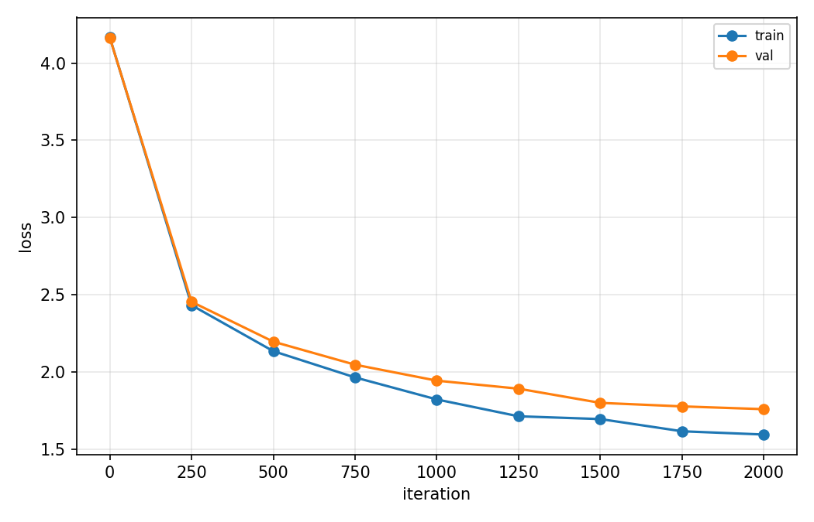
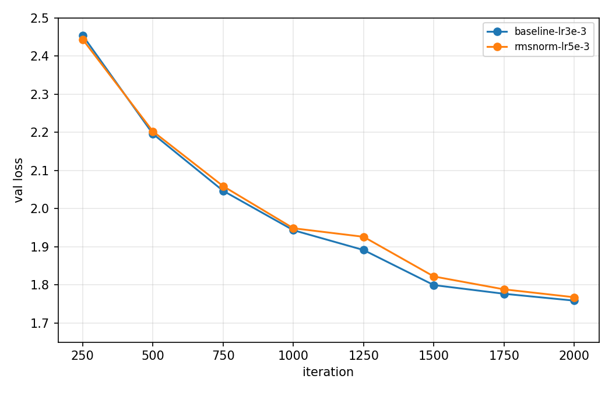
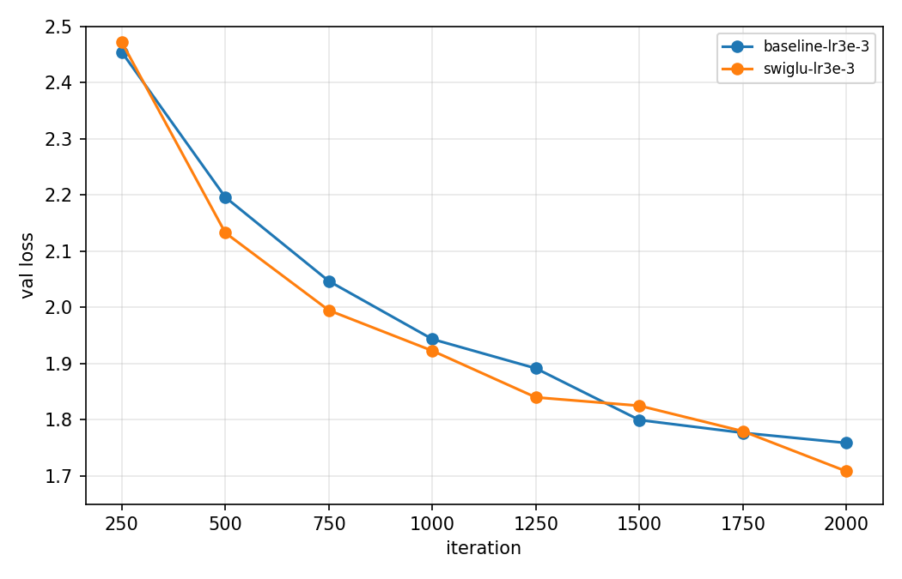
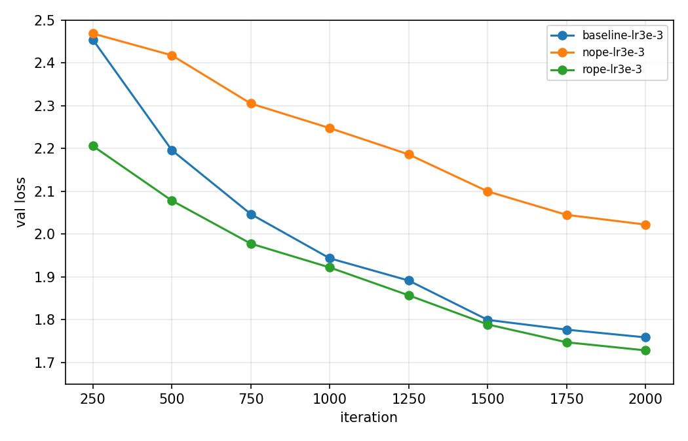
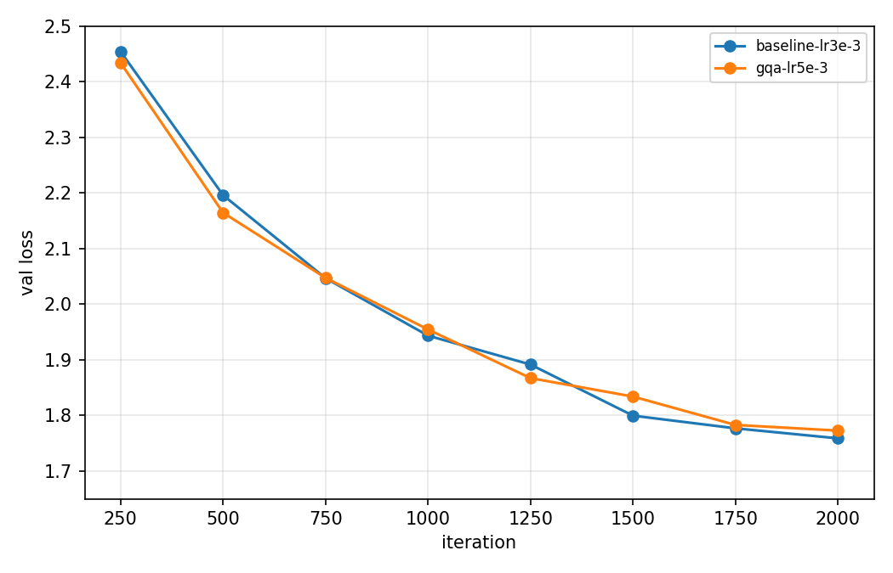

# Mini-LLM Exercise: nanoGPT architecture ablations

## Setup

All runs train a character-level model on Tiny Shakespeare, starting from `config/train_shakespeare_char.py`. They use the reduced CPU settings from the nanoGPT README quick-start ("I only have a macbook"), because training ran on a MacBook CPU:

| Setting | Value |
|---|---|
| Model | 4 layers, 4 heads, `n_embd`=128, context (`block_size`) 64 |
| Training | batch size 12, 2000 iterations, cosine decay to `min_lr` = lr/10, 100 warmup iterations |
| Regularization | dropout 0.0, weight decay 0.1, no biases (`bias=False`) |
| Evaluation | every 250 iterations, on 20 batches each of train and val |
| Seed | 1337 for every run |

**Comparison protocol.** Each sub-problem changes exactly one component relative to the baseline. Everything else is held fixed, including the iteration count and seed. For each variant, I swept the learning rate and report the run with the lowest validation loss. Every reported optimum has a worse learning rate tried on both sides of it, so none sits at the edge of its sweep.

All variants are behind flags in `model.py` (`norm_type`, `mlp_type`, `pos_type`, `n_kv_head`). With the default flags, the model is the original nanoGPT. I checked that the baseline gives a bit-identical loss before and after each change.

## Summary

| Variant | Change vs. baseline | Params | Best LR | Best val loss | vs. baseline |
|---|---|---|---|---|---|
| **Baseline** | Pre-LN LayerNorm, GELU MLP, learned absolute positions, MHA | 804,096 | 3e-3 | **1.7587** | — |
| RMSNorm | LayerNorm → RMSNorm | 804,096 | 5e-3 | 1.7676 | +0.009 (tie) |
| SwiGLU | GELU MLP → SwiGLU MLP (hidden 344) | 808,192 (+0.5%) | 3e-3 | **1.7082** | **−0.051** |
| NoPE | Positional embedding removed | 795,904 (−1.0%) | 3e-3 | 2.0222 | +0.264 |
| RoPE | Learned positions → rotary on q, k | 795,904 (−1.0%) | 3e-3 | **1.7283** | **−0.030** |
| GQA | 4 query heads share 2 KV heads (group size 2) | 738,560 (−8.1%) | 5e-3 | 1.7726 | +0.014 |

All losses are at iteration 2000, which was the best eval for every variant. Validation loss was still decreasing at the end of training for every run.

---

## 1. Baseline

With the default learning rate of 1e-3, the baseline reaches a val loss of 1.8857 (train 1.7648). Tuning the learning rate gives 1.7587 at lr = 3e-3 (train 1.5944). That improvement from tuning (0.13) is larger than any architecture effect below except NoPE.



Train and val loss fall together. The final gap is about 0.16, so the model isn't overfitting within 2000 iterations.

## 2. LayerNorm

**Is the model pre-LN or post-LN?** It is **pre-LayerNorm**. In `Block.forward`, normalization is applied to the input of each sub-layer, inside the residual branch:

```python
x = x + self.attn(self.ln_1(x))
x = x + self.mlp(self.ln_2(x))
```

The residual stream itself is never normalized, except by a final `ln_f` before the LM head. Post-LN would instead normalize after the addition: `x = LN(x + attn(x))`.

**Change.** RMSNorm rescales by the root mean square, `x / sqrt(mean(x²) + ε) · g`, with no mean subtraction and no bias. Because these runs use `bias=False`, the baseline LayerNorm also has no bias. So the only real difference here is LayerNorm's mean-centering.

**Results.**

| LR | 5e-4 | 1e-3 | 2e-3 | 3e-3 | 5e-3 | 7e-3 |
|---|---|---|---|---|---|---|
| LayerNorm | 2.0124 | 1.8857 | 1.7844 | **1.7587** | 1.7706 | — |
| RMSNorm | 2.0086 | 1.8823 | 1.7793 | 1.7697 | **1.7676** | 1.7718 |



**Comparison.** The two norms perform essentially the same. At matched learning rates they differ by 0.001–0.011, and the sign flips: RMSNorm is slightly better at lower rates, LayerNorm at 3e-3. Comparing tuned bests, LayerNorm is ahead by 0.009, which is within run-to-run noise for single-seed runs. The curves overlap throughout training.

This fits the motivation for RMSNorm: the re-scaling, not the re-centering, is what does the useful work. RMSNorm gets the same quality with slightly less computation and no mean statistic. (I didn't measure wall-clock speed precisely.)

## 3. MLP

**What activation does the MLP use?** **GELU** (`nn.GELU()`, the exact erf form). The MLP is `Linear(d → 4d) → GELU → Linear(4d → d)`.

**Change.** SwiGLU replaces it with a gated MLP:

```
MLP(x) = W_down( SiLU(W_gate x) ⊙ (W_up x) )
```

SwiGLU has three weight matrices instead of two. To keep the parameter count about the same, I scaled the hidden width by 2/3: 3·d·h ≈ 2·d·4d gives h ≈ (8/3)d = 341, rounded up to 344 (a multiple of 8). The total parameter count is 808,192 against 804,096, which is +0.5%.

**Results.**

| LR | 2e-3 | 3e-3 | 5e-3 |
|---|---|---|---|
| Baseline (GELU) | 1.7844 | **1.7587** | 1.7706 |
| SwiGLU | 1.7331 | **1.7082** | 1.7223 |



**Comparison.** SwiGLU is the **best single change**. It improves val loss by **0.051** at about the same parameter count, and it beats GELU at every learning rate tested, by 0.05 each time. That consistency makes the improvement more convincing than a single best-vs-best number. Training loss is also lower (1.577 against 1.594) with a similar train/val gap, so the gain comes from fitting better, not from different regularization. The validation curves do cross briefly around iterations 1500–1750.

A plausible explanation is the gate. The multiplicative interaction between the two projections lets each hidden unit decide, depending on the input, how much of its signal to pass through. A single fixed nonlinearity can't do that.

## 4. Positional encoding

**What positional embedding does the model use?** **Learned absolute positional embeddings.** `wpe = nn.Embedding(block_size, n_embd)` holds one trainable vector per position (64 here), which is added to the token embedding before the first block.

**Variants.**
1. **NoPE.** `wpe` is removed, and token embeddings enter the blocks directly. The causal attention mask is then the only source of position information.
2. **RoPE.** `wpe` is removed. Inside each attention layer, after splitting into heads, every (even, odd) channel pair of the queries and keys is rotated by the angle `pos · θ_i`, with `θ_i = 10000^(−2i/d_head)`. Values are not rotated. I checked that q·k then depends only on the offset between positions: the score for positions (10, 7) equals the score for (40, 37).

Both variants have 8,192 fewer parameters (−1.0%), because the 64 × 128 `wpe` table is gone.

**Results.**

| LR | 1e-3 | 2e-3 | 3e-3 | 5e-3 |
|---|---|---|---|---|
| Baseline (learned) | 1.8857 | 1.7844 | **1.7587** | 1.7706 |
| NoPE | 2.0373 | 2.0240 | **2.0222** | 2.1265 |
| RoPE | — | 1.7501 | **1.7283** | 1.7444 |



**Comparison.**
- **RoPE is better than learned positions, by 0.030.** It's ahead at every eval and at every learning rate tested. The advantage is largest early in training: at iteration 250, RoPE is at 2.21 against 2.45 for the baseline. RoPE builds relative position directly into the attention score. That's the information next-character prediction needs most ("what were the last few characters?"), and the model doesn't have to learn it from scratch. The gap shrinks as the learned table catches up.
- **NoPE is clearly worse, by 0.264.** That's the largest effect in this study. Without positional information, a first-layer attention score depends only on token content, so the layer can't single out "the previous character" from an identical character further back. The causal mask does leak position indirectly (position *t* attends over exactly *t*+1 tokens). So the model can build a positional signal in early layers and use it later, which is why it still learns a lot (4.2 → 2.02). But it has to spend depth and training time deriving that signal, and the result is imprecise. With only 4 layers and 2000 iterations, that cost shows up as a large gap, and NoPE also learns much more slowly early on (2.42 against 2.20 at iteration 500). Larger or longer-trained models are reported to close much of this gap, so this result is specific to the small, short-training regime here.

## 5. Grouped-query attention

**Change.** The baseline uses multi-head attention, where each of the 4 heads has its own query, key and value projections. With GQA at group size 2, there are still 4 query heads but only 2 key/value heads. Query heads 0 and 1 share KV head 0, and query heads 2 and 3 share KV head 1. In code, the K and V projections output `n_kv_head · head_dim` = 64 features instead of 128, and `repeat_interleave` copies each KV head to its group before attention. I checked correctness: the GQA model gives exactly the same outputs as an MHA model whose K and V weights are duplicated within each group.

This removes half of the K and V projection weights, 65,536 parameters in total (−8.1% of the model). At inference time it also halves the KV cache.

**Results.**

| LR | 2e-3 | 3e-3 | 5e-3 | 7e-3 |
|---|---|---|---|---|
| Baseline (MHA) | 1.7844 | **1.7587** | 1.7706 | — |
| GQA | 1.8305 | 1.7801 | **1.7726** | 1.7779 |



**Comparison.** GQA is close to MHA: 0.014 worse at the tuned best, with 8% fewer parameters. The gap depends on the learning rate. GQA is 0.046 worse at 2e-3 but nearly equal at 5e-3 (+0.002), and its optimum is at a higher rate than the baseline's. The validation curves cross several times during training. The small loss is consistent with reduced attention capacity, since each pair of query heads must share one key/value view. With only 4 heads, that sharing is coarse.

GQA's main benefits are a smaller KV cache and faster inference with long contexts. These short training runs don't measure either. The result here shows the other half of the trade-off: almost no loss in quality.

---

## Limitations

- **Reduced model.** These results use the small CPU configuration (4 layers, 128-dim, context 64, 2000 iterations), not the full default config (6 layers, 384-dim, context 256, 5000 iterations, dropout 0.2). Effect sizes, especially for NoPE, may differ at larger scale.
- **One seed per run.** I'd treat differences below about 0.01–0.02 (RMSNorm and GQA vs. the baseline) as ties. The SwiGLU, RoPE and NoPE effects are consistent across every learning rate tested, so they're more reliable.
- **Not trained to convergence.** Validation loss was still decreasing at iteration 2000 in every run. The comparison holds at a fixed training budget.
- **Only the learning rate was tuned.** Other hyperparameters (warmup, weight decay, batch size) were the same for every variant.

## Reproducing

```bash
bash run_experiments.sh baseline   # also: rmsnorm | swiglu | nope | rope | gqa
python3 plot.py -o plot_baseline.png out-baseline-lr3e-3
python3 plot.py --val-only --skip-first --ylim 1.65 2.5 -o plot_swiglu.png out-baseline-lr3e-3 out-swiglu-lr3e-3
```

Each run writes `out-<variant>-lr<lr>/loss.csv` with columns `iter, train_loss, val_loss`.
